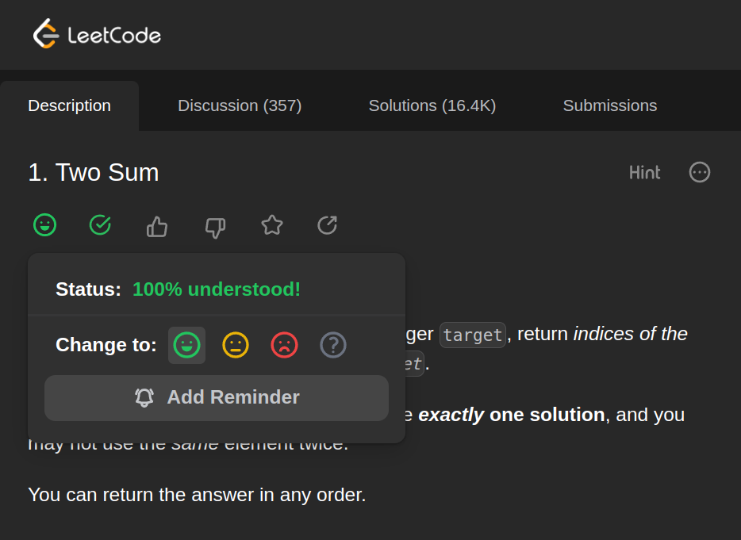
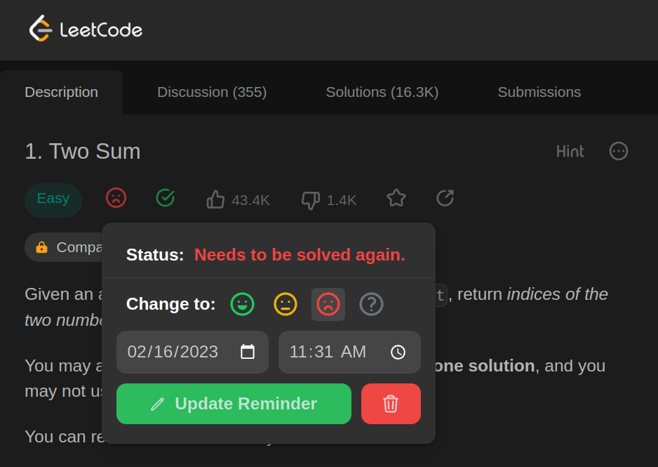
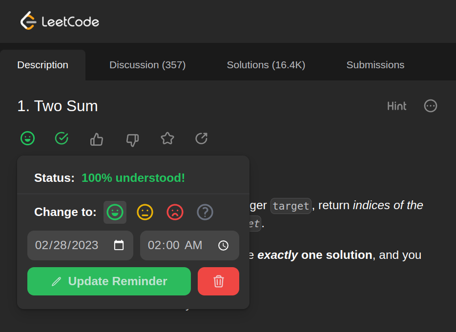

# LeetCode AIO Extension

## Introduction
This extension is used to mark problems in LeetCode by how sure you are about the solution. 
It also provides a reminder for the problems you are not sure about.

## Features
- Set the status of a problem (Happy, Neutral, Sad, or None)
- Set a reminder for a problem (a notification will be shown in the browser)
- Hides:
  - Problem difficulty
  - Problem likes and dislikes count
  - Problem statistics
- Seamless integration with LeetCode

## Installation
> The extension is not published (yet), so you need to install it manually.
1. Download the latest release from [here](https://github.com/MohammadOTaha/leetcode-aio-extension/releases)
2. Extract the downloaded file
3. Open `chrome://extensions/` in your browser
4. Enable `Developer mode` in the top right corner
5. Click on `Load unpacked` and select the extracted folder
6. Enjoy! (Go to any problem page to see the extension in action)

## Usage
After installing the extension, a new button will be added below the problem name,
through which you can set the status of the problem and/or set a reminder for it.

